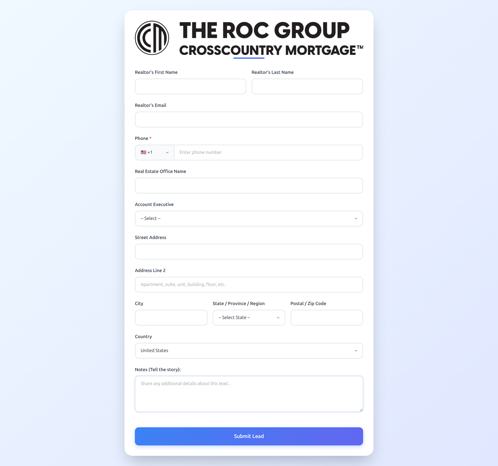

A good `README.md` makes your repo feel professional and easy to understand. Since this is for **Ivan-Lead-Form**, here’s a complete # Ivan Lead Form 🚀

A modern, responsive lead capture form built with **React (Vite + TypeScript)** and styled using **Tailwind CSS**.  
This project is designed to collect and validate user information (like name, email, language, country) with a smooth UI/UX.

---

## 📸 Preview


---

## ✨ Features
- ⚡ Built with **Vite + React + TypeScript**
- 🎨 Styled using **Tailwind CSS**
- 🌍 Supports multiple **languages & countries**
- ✅ Form validation and error handling
- 📦 Easy deployment on **Vercel / Netlify**
- 🔗 API-ready for integrations (e.g. with CRM or automation tools)

---

## 📂 Project Structure
```

ivan-lead-form/
│── public/
│   └── image.png        # Project screenshot
│── src/
│   ├── components/      # Reusable components
│   ├── assets/          # Static assets
│   ├── App.tsx          # Main app
│   └── main.tsx         # Entry point
│── index.html
│── package.json
│── tailwind.config.js
│── tsconfig.json
└── README.md

````

---

## ⚙️ Installation & Setup

### 1. Clone the repository
```bash
git clone https://github.com/N8N-Automations/Ivan-Lead-Form.git
cd Ivan-Lead-Form
````

### 2. Install dependencies

```bash
npm install
```

### 3. Start development server

```bash
npm run dev
```

### 4. Build for production

```bash
npm run build
```

---

## 🌍 Environment Variables

You can configure backend API or integrations by creating a `.env` file in the project root:

```
VITE_API_URL=https://your-api.com/endpoint
```

---

## 🚀 Deployment

* **Vercel** → just connect the repo and deploy
* **Netlify** → drag-and-drop build or connect GitHub repo
* **Custom server** → serve the `dist/` folder after `npm run build`

---

## 🛠 Tech Stack

* **React + Vite + TypeScript**
* **Tailwind CSS**
* **Node.js & npm**

---

## 🤝 Contributing

Pull requests are welcome! If you’d like to improve the project:

1. Fork the repo
2. Create your feature branch (`git checkout -b feature/my-feature`)
3. Commit changes (`git commit -m 'Add new feature'`)
4. Push branch (`git push origin feature/my-feature`)
5. Open a Pull Request

---

## 📜 License

This project is licensed under the **MIT License**.

---

## 👤 Author

Developed by **Ivan Automations Team**
For automation projects → [GitHub: N8N-Automations](https://github.com/N8N-Automations)
